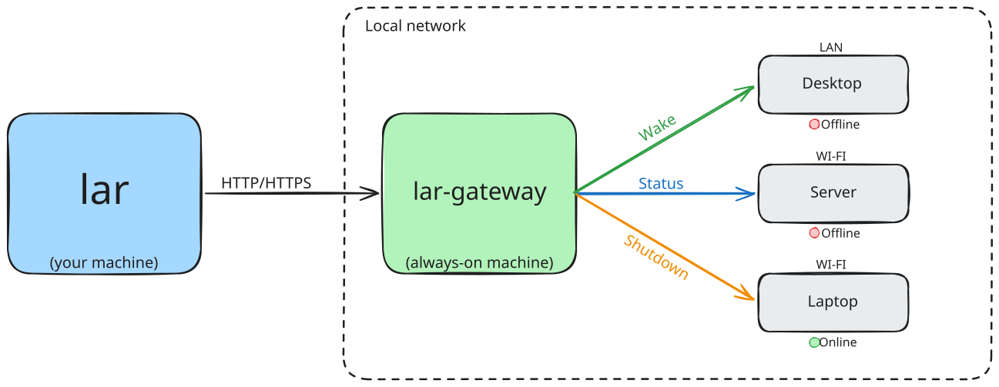

# lar

[](https://github.com/eevandeya/lar/actions/workflows/ci.yml)
[](https://github.com/eevandeya/lar/releases)
[](LICENSE)

A simple client and gateway for waking up, checking the status of, and shutting down remote machines.

## What is Lar?

Lar is a tool for managing computers over a local network.

It consists of two components:

- **Lar CLI** - a command-line client used to send commands.

- **Lar Gateway** - a lightweight service with minimal dependencies that runs
  on an always-on machine and communicates with computers on the local network.



The CLI sends commands to the Gateway, which performs the requested action on the target machine.

Lar Gateway was developed with resource-constrained devices in mind, such as
**Raspberry Pi** boards and home routers. It supports older ARM architectures,
including ARMv6 and ARMv7, and uses minimal system resources.

## Quick Start

> [!NOTE]
> Quick Start uses an unencrypted connection. For production use, see
> [TLS Configuration](#tls).

1. Install the `lar-gateway` binary on your gateway machine.

   ```bash
   curl -fsSL https://raw.githubusercontent.com/eevandeya/lar/master/scripts/install-gateway.sh | \
       sudo bash -s -- --no-service
   ```

2. Create `lar-gateway` config at `/etc/lar-gateway/config.yml`.

   A simple configuration could look like this:

   ```yaml
   server:
     broadcast: 192.168.1.255
     secret: super-secret
     arp-interface: eth0

   machines:
     my-machine:
       user: user
       address: 192.168.1.23
       identity-file: /home/user/.ssh/id_ed25519
       mac: 00:1A:2B:3C:4D:5E
   ```

   <!-- TODO: This is a temporary limitation. Remove this note once optional
   machine fields are supported. -->

> [!NOTE]
> Currently, `user` and `identity-file` are required to start the Gateway.
> For a quick test, you can use dummy values such as `user: user` and
> `identity-file: /path/to/file` instead of setting up SSH right away.
> SSH shutdown will not work until these values are properly configured.

3. Set capabilities on the binary.

   ```bash
   sudo setcap 'cap_net_raw=ep' /usr/local/bin/lar-gateway
   ```

   It needs this capability to send ARP requests.

4. Start `lar-gateway`.

   ```bash
   lar-gateway --config "/etc/lar-gateway/config.yml" --insecure
   ```

5. Install `lar` on your client machine.

   ```bash
   curl -fsSL https://raw.githubusercontent.com/eevandeya/lar/master/scripts/install-client.sh | sudo bash
   ```

6. Create a `lar` configuration file at `~/.config/lar/config.yml` and add your Gateway details to it.

   Config example:

   ```yaml
   gateway:
     address: http://192.168.1.20:8080
     secret: super-secret
   ```

7. Try it out!

   ```bash
   lar status my-machine
   ```

## Installation

### Lar CLI

Install `lar` using the installation script:

```bash
curl -fsSL https://raw.githubusercontent.com/eevandeya/lar/master/scripts/install-client.sh | \
    sudo bash
```

### Lar Gateway

Install `lar-gateway` using the installation script:

```bash
curl -fsSL https://raw.githubusercontent.com/eevandeya/lar/master/scripts/install-gateway.sh | \
    sudo bash
```

By default, the Gateway installer also installs the systemd service.

To install only the lar-gateway binary without the systemd service:

```bash
curl -fsSL https://raw.githubusercontent.com/eevandeya/lar/master/scripts/install-gateway.sh | \
    sudo bash -s -- --no-service
```

## Configuration

Lar uses YAML configuration files.

### Gateway Configuration

The Gateway configuration defines the Gateway server and the machines it manages.

Example of full config:

```yaml
server:
  host: 0.0.0.0
  port: 8080
  secret: super-secret
  broadcast: 192.168.1.255
  arp-interface: eth0
  tls:
    cert-file: /etc/letsencrypt/live/lar.example.com/cert.pem
    key-file: /etc/letsencrypt/live/lar.example.com/privkey.pem

machines:
  my-machine:
    user: user
    address: 192.168.1.23
    identity-file: /home/user/.ssh/id_ed25519
    mac: 00:1A:2B:3C:4D:5E
    ssh-port: 22
```

#### `server`

The `server` section configures the Gateway server.

| Option          | Description                                                           | Required | Default           |
| --------------- | --------------------------------------------------------------------- | -------- | ----------------- |
| `port`          | Port the Gateway listens on                                           | no       | `8080`            |
| `host`          | Host address the Gateway listens on                                   | no       | `0.0.0.0`         |
| `secret`        | Shared secret used to authenticate clients                            | yes      | -                 |
| `broadcast`     | Broadcast address used for Wake-on-LAN packets                        | no       | `255.255.255.255` |
| `arp-interface` | Network interface used to send ARP requests for machine status checks | yes      | -                 |
| `tls.cert-file` | Full path to the TLS certificate file                                 | no       | -                 |
| `tls.key-file`  | Full path to the TLS private key file                                 | no       | -                 |

#### `machines`

This section lists the machines the Gateway can communicate with.

| Option          | Description                                                      | Required | Default |
| --------------- | ---------------------------------------------------------------- | -------- | ------- |
| `user`          | Username the Gateway uses to execute SSH commands on the machine | yes      | -       |
| `address`       | Machine address on the local network reachable by the Gateway    | yes      | -       |
| `identity-file` | Full path to the SSH private key used by the Gateway             | yes      | -       |
| `mac`           | MAC address of the machine                                       | yes      | -       |
| `ssh-port`      | SSH port used to connect to the machine                          | no       | `22`    |

### Client configuration

The client configuration defines the Gateway the `lar` CLI connects to.

Example of full config:

```yaml
gateway:
  address: http://223.194.30.191:8080
  secret: super-secret
```

At the moment only two options exist. Both are **required**:

- `address` - URL of the Lar Gateway. Both HTTP and HTTPS are supported.

- `secret` - shared secret used to authenticate with the Gateway.

## CLI

### `lar`

The `lar` CLI is used to manage machines through a Lar Gateway.

#### Quick Reference

```bash
lar status <machine>
lar wake <machine>
lar shutdown <machine>
```

#### Usage

```bash
lar <command> <machine>
```

#### Commands

| Command    | Description                       |
| ---------- | --------------------------------- |
| `status`   | Check whether a machine is online |
| `wake`     | Wake a machine using Wake-on-LAN  |
| `shutdown` | Shut down a machine using SSH     |

#### `status`

Checks whether the specified machine is online.

```bash
lar status <machine>
```

Example:

```bash
lar status my-machine
```

##### Options

| Option          | Description                                                                       |
| --------------- | --------------------------------------------------------------------------------- |
| `-q`, `--quiet` | Suppress output. Exits with `0` if the machine is online and `1` if it is offline |

#### `wake`

Wakes the specified machine using Wake-on-LAN.

```bash
lar wake <machine>
```

Example:

```bash
lar wake my-machine
```

#### `shutdown`

Shuts down the specified machine using SSH.

```bash
lar shutdown <machine>
```

Example:

```bash
lar shutdown my-machine
```

#### Global options

| Option            | Description                    |
| ----------------- | ------------------------------ |
| `--config <path>` | Path to the configuration file |
| `-h`, `--help`    | Show help information          |
| `-v`, `--version` | Show the installed version     |
| `-d`, `--debug`   | Run command in debug mode      |

### `lar-gateway`

The `lar-gateway` CLI is used to configure and run Lar Gateway.

```bash
lar-gateway [options]
```

> [!TIP]
> `lar-gateway` uses HTTPS by default, so you must configure TLS before starting it. To run the Gateway over unencrypted HTTP, add the `--insecure` flag.

| Option            | Description                                                       |
| ----------------- | ----------------------------------------------------------------- |
| `--config <path>` | Path to configuration file (default: /etc/lar-gateway/config.yml) |
| `--debug`         | Enable debug output                                               |
| `--insecure`      | Allow the server to run without TLS using HTTP                    |
| `--version`       | Show the installed version                                        |

> [!NOTE]
> When running as a systemd service, `lar-gateway` runs as the `lar` user.
> All files specified in the configuration, including SSH private keys and TLS certificates and private keys,
> must be readable by this user and have appropriate permissions.

## TLS

Lar Gateway supports both unencrypted HTTP and HTTPS connections.

Using HTTP is suitable for testing and trusted local environments, but it is
not recommended for production use. HTTP traffic, including the shared secret,
is transmitted without encryption.

For production deployments, use HTTPS. TLS can be handled in either of two ways:

- **Lar Gateway** can terminate TLS directly using its `tls` configuration.

- **A reverse proxy** can terminate TLS and forward requests to the Gateway over unencrypted HTTP. In this case, start the Gateway with the `--insecure` flag.

> [!NOTE]
> Lar Gateway does not manage or automatically renew TLS certificates.
> Certificate renewal is the user's responsibility.

## Uninstallation

### Lar Gateway

If installed with the default installer:

```bash
# Stop and remove the service
sudo systemctl disable --now lar-gateway.service
sudo rm /etc/systemd/system/lar-gateway.service
sudo systemctl daemon-reload

# Remove the configuration
sudo rm -rf /etc/lar-gateway

# Remove the user
sudo userdel lar

# Remove the binary
sudo rm /usr/local/bin/lar-gateway
```

If installed with `--no-service`:

```bash
# Remove the configuration
sudo rm -rf /etc/lar-gateway

# Remove the binary
sudo rm /usr/local/bin/lar-gateway
```

### Lar CLI

```bash
# Remove the configuration
rm -rf ~/.config/lar

# Remove the binary
sudo rm /usr/local/bin/lar
```

## Contributing

Contributions are welcome. Feel free to open an issue or submit a pull request.
